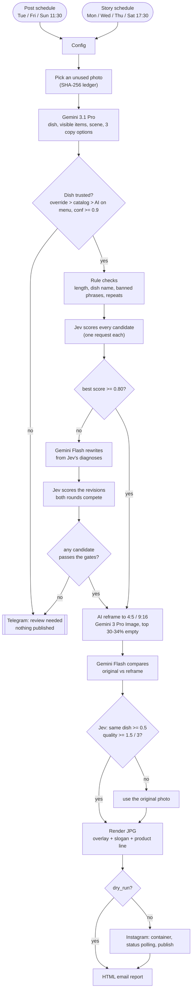
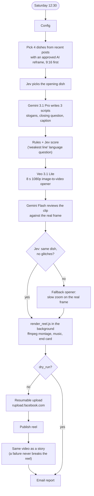

# n8n Instagram Autopilot

**Instagram on autopilot for a local business: from a folder of food photos to designed posts, stories and a weekly AI reel.
AI writes, a decision model judges, and nothing gets published unless it passes the gates.**

[](https://n8n.io)
[](LICENSE)
[](#requirements)
[](#3-credentials)
[](#the-pattern-gemini-sees-and-writes-jev-decides)

[Türkçe README](README.tr.md)

You drop real photos of your dishes into a folder. Three times a week a feed post and four times a week a story
appear on Instagram: the photo is recomposed by AI for the format, your logo and footer are laid over it, a
headline and a product line are set in your font, and a caption with exactly five hashtags is written. Every
Saturday the best recent shots become a short reel with an AI-animated opener and music. After each publish you
get an email with the image, the copy, every rejected alternative and why it lost.

This has been running in production for a real restaurant's Instagram account (it stays unnamed here).
Everything in this repo is the production logic, anonymized and made configurable.

---

## Contents

- [Why this exists](#why-this-exists)
- [How it works](#how-it-works)
- [The pattern: Gemini sees and writes, Jev decides](#the-pattern-gemini-sees-and-writes-jev-decides)
- [Features](#features)
- [Requirements](#requirements)
- [Quick start](#quick-start)
- [Configuration reference](#configuration-reference)
- [Cost](#cost)
- [Lessons learned in production](#lessons-learned-in-production)
- [Troubleshooting / FAQ](#troubleshooting--faq)
- [Limitations](#limitations)
- [Related](#related)

## Why this exists

"Let an LLM post to Instagram" is easy. Letting it post **unattended** for a business whose customers will
notice a wrong dish name, an invented side dish or a broken sentence is not. What makes this different:

- **Nothing is trusted by default.** The dish name comes from a verified catalog or your override before any
  AI guess; the AI guess must be on your menu with >= 0.9 confidence. Otherwise nothing is posted and you get
  a Telegram message.
- **A separate judge.** Copy is written by Gemini but scored by [Jev](#the-pattern-gemini-sees-and-writes-jev-decides),
  a typed decision model that cannot write and cannot see. One request per candidate, weighted score, hard gates,
  one revision round driven by the judge's own diagnoses.
- **AI images are checked for truthfulness.** The AI reframe must not change the food. A second model compares
  original vs reframe; if in doubt, the original photo is used.
- **Every step degrades gracefully.** Judge down, image model down, video rejected, email broken: each has a
  defined fallback. Apart from Meta itself failing, only "we are not sure what dish this is" or "no copy passed"
  stops a publish.
- **Real design, not a template screenshot.** A GraphicsMagick compositor with fixed-anchor typography and an
  automatic readability scrim; an ffmpeg montage with sub-pixel motion for the reel.

## How it works

### Posts and stories (Tue/Fri/Sun 11:30 post, Mon/Wed/Thu/Sat 17:30 story)



1. A schedule fires; **only that day's format** is produced (post or story).
2. An unused photo is picked (photos are remembered by SHA-256, so renaming does not make a photo "new").
   Photos whose dish is already known go first.
3. Gemini 3.1 Pro looks at the photo: which dish from your menu, what is *visibly* on the plate, a one-line
   scene description, and three clearly different headline + caption options in your `language`. The tone
   "angle" is chosen by product type, so a soup is never praised for its grill marks.
4. The dish name is decided by code (see [gates](#quality-gates-at-a-glance)), never by the judge.
5. Rule checks, then Jev scores every surviving candidate. Below 0.80 the judge's diagnoses become revision
   instructions, Gemini Flash writes three more, and all candidates compete. No candidate passes: no post.
6. The photo is recomposed by AI for the format with the top third empty for text; a second model and Jev
   check that the food did not change.
7. `render_one.sh` composes overlay + white slogan + accent product line; five hashtags are added
   (brand, product, category, city, one rotating discovery tag).
8. Container, status polling, publish, permalink, email with the image and all candidate scores.

### Weekly AI reel (Saturday 12:30, fully automatic)



The reel reuses what the posts pipeline already approved: frames from the last 8 days (then 30 days, then all)
that were published **with** an accepted AI reframe, four different dishes, story frames first. The montage
(`scripts/render_reel.js`) runs detached with `setsid` because it takes about 2.5-3 minutes on 4 cores; the
workflow polls for its `done.json`. The video is uploaded with Meta's resumable upload
([why](#lessons-learned-in-production)) and then shared again as a story.

## The pattern: Gemini sees and writes, Jev decides

[Jev](https://openrouter.ai) (`typesafe/jev-1.13`, by TypeSafe, served through OpenRouter's
`POST https://openrouter.ai/api/alpha/decisions`) is a **typed decision model**. You send a `state` and named
`questions`; it answers each one in a fixed type:

| Type | Answer |
|---|---|
| `noul` | a probability that the statement is true |
| `choice` | one of up to 255 options + probabilities + confidence |
| `score` | 2-10 ordered levels -> a weighted score from 0 to n-1 |

```json
{
  "model": "typesafe/jev-1.13",
  "state": { "dish": "Lemon Tart", "visible_in_photo": ["tart slice", "powdered sugar"], "title": "Bright, buttery, crisp" },
  "questions": {
    "title_grammar": { "type": "score", "instructions": "Rate the English grammar of the title.",
                       "criteria": ["broken", "awkward", "correct but plain", "natural"] },
    "dish_match":    { "type": "noul", "instructions": "Is the title about the named dish?",
                       "criteria": { "true": "about the dish", "false": "about something else" } }
  }
}
```

It answers in about 0.3-0.8 s, costs $0.042 per million input tokens (output is free) and has a 32k context.
It does **not** generate text and does **not** see images. So the work is split:

| Step | Gemini: sees and writes | Jev: decides | Code: enforces |
|---|---|---|---|
| Dish name | names it from your menu | never asked | override > catalog > AI on menu with conf >= 0.9 |
| Copy | 3 options, then 3 revisions | scores each candidate, diagnoses problems | rules, gates, 0.80 threshold, both rounds compete |
| AI reframe | makes it, then writes a comparison report | "same dish?", "usable?" | falls back to the original photo |
| Reel script | 3 scripts | "weakest line" grammar, appeal, fit | fallback script |
| Reel opener | Veo animates, Gemini reviews the clip | "truthful?", "usable?" | falls back to a zoom on the real frame |

Jev is optional. Every Jev call sits behind a `Jev On?` switch (`jev_enabled`), the HTTP nodes continue on
error, and every decision node has the pre-Jev behaviour as its fallback: the first candidate that passed
Gemini's own rule checks.

### Quality gates at a glance

| Gate | Where | Fails when | Then |
|---|---|---|---|
| Dish identity | code | not on the menu, or AI confidence < 0.9 without catalog/override | no post, Telegram review |
| Copy rules | code | length, missing dish name, headline repeats dish name, price/promo, banned phrase, repeat | candidate dropped |
| Product match | Jev `noul` | < 0.5 | candidate dropped |
| Headline language | Jev `score` | < 1.5 / 3 | candidate dropped |
| Caption language (posts) | Jev `score` | < 1.5 / 3 | candidate dropped |
| Faithful to the photo (posts) | Jev `noul` | < 0.35 | candidate dropped |
| Quality score | weighted | best < 0.80 | one revision round, both rounds compete |
| Nothing left | - | no candidate passes | no post, Telegram review |
| Reframe truthful / usable | Jev | same dish < 0.5 or quality < 1.5 | original photo used |
| Reel script | Jev | worst line < 1.5, fit < 0.4 | fallback script |
| Reel opener | Jev | same dish < 0.5 or quality < 1.5 | zoom on the real frame |

Post score = focus .25 + appetite .25 + headline language .15 + caption language .15 + faithfulness .10 +
caption appeal .10. Stories only show the headline: focus .35 + appetite .40 + headline language .25.
Full question definitions: [docs/quality-gates.md](docs/quality-gates.md).

## Features

- 3 feed posts + 4 stories per week, one format per run, from a plain folder of photos
- Dish naming you can trust: verified catalog, manual overrides, strict AI fallback, review via Telegram
- Three copy options per run, all scored independently; judge-driven revision round
- AI reframe to 4:5 / 9:16 with a text-safe top area, checked against the original
- GraphicsMagick compositor: fixed-anchor text block, 12° italic, optical-height scaling, automatic scrim
- Exactly 5 hashtags: brand, product (ASCII-folded, long names cut to the last two words), category, city,
  and a rotating discovery tag
- Weekly reel: Jev-picked opener, Veo image-to-video with truthfulness check, sub-pixel ffmpeg motion,
  least-used music rotation, end card with question + call to action, also posted as a story
- Resumable video upload (no public video URL needed)
- HTML email after every run: image, copy, every candidate with score and reason, reframe verdict
- `dry_run` mode: renders and emails everything, publishes nothing
- Output language, brand, colours, font, hashtags, banned phrases, models: all in one `Config` node per workflow
- Ledgers in plain JSON; nothing needs a database

## Requirements

- **Self-hosted n8n 2.x** (built and run on the Docker image `n8nio/n8n:latest`, which includes GraphicsMagick `gm`).
- Environment: `NODE_FUNCTION_ALLOW_BUILTIN=fs,crypto,child_process` (the Code nodes read/write files and run the render scripts).
- A host folder bind-mounted into the container, e.g. `./downloads:/data/downloads` (`data_dir` = `/data/downloads/instagram`).
- **ffmpeg** for the reel: a static Linux build placed in the mounted folder (default `/data/downloads/bin/ffmpeg`); the n8n image has none.
- A **public HTTPS URL** for your n8n instance: Meta fetches the rendered images from the media server webhook.
- An **Instagram professional account** connected to a Facebook Page, and a Graph API token that can publish.
- A **Google Gemini API** key. Image and video generation models generally need billing enabled.
- Optional but recommended: an **OpenRouter** key for Jev. Telegram bot + SMTP account for alerts and reports.
- Timezone: schedules and email dates use the instance timezone (`GENERIC_TIMEZONE`) or the workflow's timezone
  setting. Set it; the exported workflows do not carry one.

## Quick start

### 1. Prepare the data folder

```sh
# on the Docker host, next to your docker-compose.yml
mkdir -p downloads/instagram downloads/bin
cp -r examples/data-dir/. downloads/instagram/          # state/, music/, assets/layout.env, photos/
mkdir -p downloads/instagram/scripts
cp scripts/*.sh scripts/*.js downloads/instagram/scripts/
cp /path/to/your-font.ttf downloads/instagram/assets/font.ttf
cp /path/to/static/ffmpeg downloads/bin/ffmpeg && chmod +x downloads/bin/ffmpeg
```

- Put your photos in `photos/` and your publishable dish names in `state/menu.json`.
- Add your overlays: `assets/post_overlay.png` (2304x2880) and `assets/story_overlay.png` (2160x3840),
  transparent PNGs with your logo on top and a footer box. No artwork yet? Generate placeholders inside the
  container: `sh /data/downloads/instagram/scripts/make_placeholder_assets.sh /data/downloads/instagram/assets/font.ttf`.
  Details: [docs/overlay-spec.md](docs/overlay-spec.md).
- Optional: `state/photo_dishes.json` (photo -> dish catalog), `assets/logo.png` + `assets/end_box.png` for the
  reel end card, music files + `music/library.json`.

```text
<data_dir>/                      (default /data/downloads/instagram inside the container)
├── photos/          your food photos
├── assets/          post_overlay.png, story_overlay.png, font.ttf, logo.png*, end_box.png*, layout.env*
├── scripts/         render_one.sh, render_frame.sh, render_reel.js
├── state/           menu.json, photo_dishes.json*, photo_overrides.json, ledger.json, reels_ledger.json
├── music/           library.json + your tracks*
├── work/            intermediates (AI reframes, reel work folders)
└── out/             final JPG / MP4 files, served by the media server
                                                              * optional
```

Full layout and file formats: [docs/folder-layout.md](docs/folder-layout.md).

### 2. Import the workflows

In n8n: *Workflows -> Import from File*, four times:

| File | Workflow |
|---|---|
| `workflows/media-server.json` | serves `out/` files at `https://<your-n8n>/webhook/ig-media?f=<file>` |
| `workflows/error-notifier.json` | Telegram alert on any failure |
| `workflows/instagram-autopilot.json` | posts and stories |
| `workflows/weekly-ai-reel.json` | weekly reel |

Activate **Media Server** right away and open `https://<your-n8n>/webhook/ig-media?f=test.jpg` once: an n8n error
response (the file does not exist yet) means the webhook is reachable; a 404 means it is not active.

### 3. Credentials

| n8n credential type | Used by | How to get it |
|---|---|---|
| **Google Gemini(PaLM) API** | `Analyze Photo (Gemini)` and every Gemini / Veo HTTP Request node | API key from Google AI Studio. Keep the default host `https://generativelanguage.googleapis.com`. |
| **Header Auth** | the `Jev: ...` HTTP nodes (3 per workflow) | OpenRouter API key. Name: `Authorization`, Value: `Bearer <your OpenRouter key>`. |
| **Facebook Graph API** | container, status, publish, permalink nodes and the two `Upload ... (resumable)` HTTP nodes | A long-lived token (e.g. a Business Manager system user) with `instagram_basic`, `instagram_content_publish`, `pages_show_list`, `pages_read_engagement`. |
| **Telegram API** | `Telegram: Review Needed`, `Telegram: Error Alert` | Bot token from @BotFather. Send your bot a message, then read your chat id from `https://api.telegram.org/bot<token>/getUpdates`. |
| **SMTP** | both `Send Email` nodes | Any SMTP account (for Gmail use an app password). |

Open each workflow and pick your credential in every node that shows a warning. The resumable upload nodes use
the Facebook Graph API credential through the HTTP Request node: n8n appends it as the `access_token` query
parameter, which is all `rupload.facebook.com` needs.

Your Instagram user id (`ig_user_id`): in the Graph API Explorer run
`GET /me/accounts?fields=instagram_business_account{id,username}` and copy `instagram_business_account.id`.

### 4. Fill in the Config nodes

Each workflow starts with a `Config` node (Set node, JSON). Change at least `brand_name`, `brand_context`,
`ig_user_id`, `public_media_url`, `hashtags`, `telegram_chat_id`, `email_from`, `email_to`, and set
`language` / `locale` if you do not post in English. Keep shared keys identical in both workflows.
All keys are listed in the [configuration reference](#configuration-reference).

### 5. Connect the error workflow

Open **Posts & Stories** and **Weekly AI Reel** -> *Settings* -> *Error workflow* -> **Instagram Autopilot - Error Notifier**.
(Set the Telegram credential and `telegram_chat_id` in that workflow too.)

### 6. Test with `dry_run: true` (the default)

Open **Posts & Stories**, click *Execute workflow* and choose the **Post Schedule** trigger (or Story).
With `dry_run: true` everything runs, including the AI reframe and the render, but nothing is sent to Instagram:
you get the email with the rendered image and all candidate scores, and the photo stays available.
For the reel you need at least two dishes that were published with an approved AI reframe, so run it after the
posts workflow has been live for a while.

### 7. Go live

Set `dry_run` to `false` in both Config nodes and activate both workflows. Change the schedules in the trigger
nodes if you like (cron: posts `30 11 * * 2,5,0`, stories `30 17 * * 1,3,4,6`, reel `30 12 * * 6`).

## Configuration reference

### Shared keys (both workflows)

| Key | Default | Meaning |
|---|---|---|
| `data_dir` | `/data/downloads/instagram` | Data folder inside the container |
| `public_media_url` | `https://n8n.example.com/webhook/ig-media?f=` | Public prefix of the media server; the file name is appended |
| `dry_run` | `true` | Render and email only, never publish |
| `brand_name` | `Your Restaurant` | Used in prompts, emails, the fallback reel caption |
| `brand_context` | `a local restaurant` | One phrase describing the business, used in prompts and Jev states |
| `product_prefix` | `""` | Text printed before the dish on the product line (e.g. your brand). Empty = dish only |
| `language` | `English` | Output language of all generated copy; also used in the Jev language questions |
| `locale` | `en-US` | Lower-casing, date formatting and list joining (`tr-TR`, `de-DE`, ...) |
| `ig_user_id` | `YOUR_IG_USER_ID` | Instagram professional account id |
| `graph_api_version` | `v23.0` | Graph API version (`""` = the node's default) |
| `email_from` / `email_to` | `you@example.com` | Report email |
| `hashtags` | see node | `brand`, `city`, `discovery` (rotating list), `fallback` (fills up to 5 if tags collide) |
| `banned_phrases` | time-of-day words, clichés | Never allowed in copy (Unicode-aware whole-word match); also listed in the prompts |
| `prohibited_pattern` | prices, %, promos, clock times | Regex (flags `iu`) that drops a candidate |
| `jev_enabled` | `true` | `false` routes around every Jev call |
| `jev_model` | `typesafe/jev-1.13` | Decision model id on OpenRouter |
| `model_pro` | `gemini-3.1-pro-preview` | Photo analysis, reel scripts |
| `model_flash` | `gemini-3.8-flash` | Copy revisions, reframe comparison, clip review |
| `font_path` | `""` | TTF/OTF font; empty = `<data_dir>/assets/font.ttf` |
| `slogan_color` / `accent_color` | `#FFFFFF` / `#E63946` | Slogan and product line colours (accent also colours the email header) |

### Posts & stories only

| Key | Default | Meaning |
|---|---|---|
| `photo_folders` | `["photos"]` | Folders under `data_dir` to pick photos from |
| `telegram_chat_id` | `YOUR_TELEGRAM_CHAT_ID` | Where "review needed" messages go |
| `hashtag_categories` | soup, dessert, mezze, pizza, ... | `{match, tag}` list, first regex match on the dish wins; `match: ""` = default |
| `angle_sets` | soup / dessert / fresh / default | `{match, angles}`: tone focus by product type, rotated so the last 5 are not repeated |
| `style_examples` | 3 English headlines | Tone examples shown to Gemini (write them in your `language`) |
| `title_max_words` / `title_max_chars` | `5` / `44` | Headline limits (the rendered layout is tuned for these) |
| `jev_min_score` | `0.8` | Below this the revision round runs |
| `model_image` | `gemini-3-pro-image` | AI reframe |

### Weekly reel only

| Key | Default | Meaning |
|---|---|---|
| `reel_ctas` | 3 English calls | Approved short calls to action, rotated weekly |
| `reel_fallback` | English texts | `first_line`, `question`, `cta`, `caption` (`{brand}`, `{dishes}` placeholders) when no script passes |
| `reel_line_max_words` / `reel_line_max_chars` | `4` / `30` | Slogan limits |
| `hero_keywords` | `skewer\|kebab\|steak\|...` | Regex for the opener when Jev is off |
| `model_video` | `veo-3.1-lite-generate-preview` | Opener clip model |
| `veo_resolution` | `1080p` | Opener resolution |
| `ffmpeg_path` | `/data/downloads/bin/ffmpeg` | Static ffmpeg binary |

Posting in another language: set `language` and `locale`, and translate `banned_phrases`, `style_examples`,
`angle_sets`, `reel_ctas`, `reel_fallback` and the hashtags. The prompts themselves stay in English and tell the
model which language to write in.

## Cost

- **Weekly reel: about $0.5 per week in production**, most of it the 8 s 1080p Veo 3.1 Lite opener.
- **Posts and stories** (7 runs a week): per run one Gemini 3.1 Pro vision call, one Gemini 3 Pro Image
  generation (2K; usually the largest item), one Gemini Flash image comparison, sometimes one Flash revision.
  Check Google's current price list for your volume.
- **Jev**: $0.042 per million input tokens, output free. A run makes a handful of calls of a few hundred to a
  couple of thousand tokens each, which is a rounding error next to the image model.
- Rejections cost a little extra (a revision round, a rejected Veo clip), never a lot: every step runs at most once or twice.

## Lessons learned in production

**About the models**

1. **AI dish naming alone was not reliable.** Two strong vision models disagreed on the dish for 52% of 66 photos.
   Hence the priority: owner override > photo -> dish catalog > AI guess (on the menu, confidence >= 0.9).
2. **Never delegate product identity to the judge.** Jev cannot see the photo; choosing the dish from Gemini's text
   description it was wrong in 4 of 8 cases where Gemini itself was >= 0.9 right.
3. **The judge is very good at text quality.** Wrong product scored 0.02, a detail that is not in the photo 0.05,
   a half-finished headline 0.7 / 3. That is exactly what you want to gate on.
4. **A "main issue" choice question always finds an issue**, usually "cliché", even for good copy. Use it as a
   revision hint, never as a gate.
5. **Ask for the weakest line, not the average.** For the reel's four slogans, an overall grammar score averaged a
   single broken line away. "Rate the worst single line" caught it.
6. **One request per candidate.** Scoring candidates independently keeps scores comparable; the best one wins.
7. **Let both rounds compete.** A revision is not always better than the original.
8. **Pick the tone by product type.** A fixed list of "angles" produced a soup praised for its grill texture.
9. **Repeating the dish name in the headline is a rule violation**: it is already printed right below it.
10. **Generated calls to action drifted into broken grammar**, so the short closing call rotates through an approved list.
11. **Music generation had a low hit rate**: 2 of 8 Lyria candidates passed. Gemini 3.1 Pro's audio critique
    matched human taste, so tracks are approved once, kept in `music/library.json`, and the least-used one rotates.

**About the plumbing**

12. **Meta could not fetch the video from an n8n webhook**: it sends `HEAD` (n8n answers 404) and expects
    `Content-Length` / `Range` support, and fails with error 2207077. The fix is `upload_type=resumable` plus a
    binary `POST` to the returned `rupload.facebook.com` URI. The n8n Facebook Graph API credential (sent as the
    `access_token` query parameter) is enough. Images and covers are still fetched from the webhook fine.
13. **The API has no "share reel to story" sticker.** The same video is uploaded again as a story, and every node on
    that branch continues on error, so a failed story never breaks the published reel.
14. **Use MIFF for GraphicsMagick intermediates.** With PNG intermediates a render was about 10x slower and blew
    n8n's 300 s limit.
15. **GraphicsMagick is not ImageMagick.** In the gm build we ran, `gm composite -dissolve` onto a transparent canvas
    returned opaque black and `-channel Alpha` does not exist, so the reel's text shadows and scrim are drawn in ffmpeg.
16. **Sub-pixel motion or it judders.** Zooms done with pixel-step `scale`/`crop` visibly stepped; ffmpeg's
    `perspective` filter (`eval=frame`, cubic interpolation) is smooth.
17. **Long jobs go to the background.** The montage takes minutes, so it is started with `setsid` and polled,
    instead of holding a Code node open.
18. **Reports must never break publishing.** Email nodes continue on error; the ledger is written before the email.
19. **Hashtag hygiene**: exactly five, ASCII-folded product/category tags, product names longer than 20 characters
    cut to their last two words (nobody searches for a 30-letter tag), one discovery tag rotating per post.

## Troubleshooting / FAQ

**A run ends without doing anything.** There is no unused photo left (every photo is published once). Add photos.
An empty `state/menu.json` stops the run with an error instead.

**Telegram says "review needed".** The dish could not be named safely, or no copy passed the gates (the message says
which). Add `"<file name>": "<dish>"` to `state/photo_overrides.json`; that photo is retried first on the next run.

**"The Meta media container was not ready after three checks".** Meta could not download `image_url`. Open the URL
from the email in a private browser window: it must be public HTTPS and return the JPG. Is the Media Server workflow
active? Does `public_media_url` end with `?f=`?

**`Cannot find module 'fs'` / `child_process` is not allowed.** Set `NODE_FUNCTION_ALLOW_BUILTIN=fs,crypto,child_process`
and restart n8n.

**`gm: not found` / `Font not found`.** Use the official image (it ships GraphicsMagick) or install it; put a font at
`<data_dir>/assets/font.ttf` or set `font_path`.

**The render is slow or times out.** Keep the MIFF intermediates; give the container CPU. A render normally takes
well under a minute; the Code node allows 280 s.

**"Not enough frames for a reel".** The reel needs published posts/stories of at least two different dishes whose
AI reframe was accepted. Let the posts workflow run for a week first.

**"The reel montage did not finish".** Read `<data_dir>/work/<reel id>/render.log` and `render.out`. Typical causes:
wrong `ffmpeg_path`, a build without `libx264`, or a slow CPU (increase the `Montage Wait` nodes).

**I do not want to use Jev.** Set `jev_enabled: false`. If n8n complains that the `Jev: ...` nodes have no
credential, deactivate those nodes (they are never reached with Jev off) or attach any Header Auth credential.

**Dates in the email are in the wrong timezone.** Set `GENERIC_TIMEZONE` or the workflow timezone.

**Can I post a dish that is not on the menu?** No, by design. Add it to `state/menu.json`.

## Limitations

- One Instagram account per copy of the workflows. Single images only (no carousels).
- Built and tuned for food photos of a restaurant; prompts, angles and gates assume that.
- The prompts were translated to English from the production version (which generated copy in another language)
  and the output language became a setting. The English defaults were tested with mocked model responses; tune
  `banned_phrases`, `style_examples` and the limits for your language after a few dry runs.
- The reel depends on the posts pipeline: no approved AI reframes, no reel.
- The media server serves every JPG/MP4 in `out/` to anyone who knows the file name (Meta needs a public URL). Do
  not put private files there.
- Instagram API rules, permissions and rate limits change; check Meta's current documentation.

## Related

- [n8n-instagram-reels-publisher](https://github.com/bugraskl/n8n-instagram-reels-publisher): a standalone n8n workflow for
  the resumable reel upload, if you only need that part.
- [n8n-grounded-blog-writer](https://github.com/bugraskl/n8n-grounded-blog-writer): a WordPress blog writer with trend signals, grounded research and a number checker.
- [n8n-gmail-ai-labeler](https://github.com/bugraskl/n8n-gmail-ai-labeler): hourly Gmail labeling with a typed decision model (same Jev pattern).

## Contributing

Issues and pull requests are welcome. Please describe the n8n version, what you changed in `Config`, and attach
the relevant ledger entry or `render.log` (remove anything private). Keep new behaviour behind a Config key and
give every new AI step a fallback.

## License

[MIT](LICENSE)
