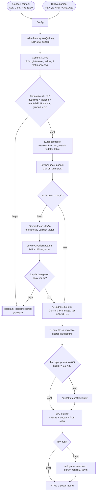
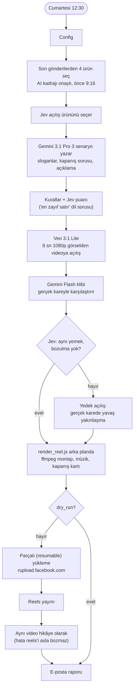

# n8n Instagram Autopilot

**Yerel bir işletme için otomatik pilotta Instagram: bir klasör yemek fotoğrafından tasarımlı gönderilere, hikâyelere ve haftalık bir yapay zekâ reels videosuna.
Yapay zekâ yazar, bir karar modeli değerlendirir; kapılardan geçmeyen hiçbir şey yayınlanmaz.**

[](https://n8n.io)
[](LICENSE)
[](#gereksinimler)
[](#3-kimlik-bilgileri)
[](#desen-gemini-görür-ve-yazar-jev-karar-verir)

[English README](README.md)

Yemeklerinizin gerçek fotoğraflarını bir klasöre atarsınız. Haftada üç kez akışta bir gönderi, dört kez bir hikâye
yayınlanır: fotoğraf yapay zekâyla formata göre yeniden kadrajlanır, logonuz ve alt bilgi kutunuz üstüne yerleşir,
kendi yazı tipinizle bir başlık ve ürün satırı dizilir, tam beş etiketli bir açıklama yazılır. Her cumartesi son
haftanın en iyi kareleri, açılışı yapay zekâyla canlandırılmış, müzikli kısa bir reels videosuna dönüşür. Her
yayından sonra görseli, metni, elenen her alternatifi ve neden kaybettiğini içeren bir e-posta gelir.

Bu sistem gerçek bir restoranın Instagram hesabında üretimde çalışıyor (restoranın adı burada verilmiyor).
Bu depodaki her şey üretimdeki mantığın ta kendisi; anonimleştirildi ve ayarlanabilir hâle getirildi.

---

## İçindekiler

- [Neden var](#neden-var)
- [Nasıl çalışır](#nasıl-çalışır)
- [Desen: Gemini görür ve yazar, Jev karar verir](#desen-gemini-görür-ve-yazar-jev-karar-verir)
- [Özellikler](#özellikler)
- [Gereksinimler](#gereksinimler)
- [Hızlı başlangıç](#hızlı-başlangıç)
- [Ayar başvurusu](#ayar-başvurusu)
- [Maliyet](#maliyet)
- [Üretimde öğrendiklerimiz](#üretimde-öğrendiklerimiz)
- [Sorun giderme / SSS](#sorun-giderme--sss)
- [Sınırlamalar](#sınırlamalar)
- [İlgili](#ilgili)

## Neden var

"Bir dil modeli Instagram'a paylaşım yapsın" demek kolay. Müşterilerinin yanlış ürün adını, uydurulmuş bir yan
lezzeti ya da bozuk bir cümleyi fark edeceği bir işletme için bunu **gözetimsiz** yaptırmak kolay değil. Farkı şu:

- **Varsayılan olarak hiçbir şeye güvenilmez.** Ürün adı önce doğrulanmış katalogdan ya da sizin düzeltmenizden
  gelir; yapay zekânın tahmini ancak menünüzde varsa ve güveni >= 0,9 ise kabul edilir. Aksi hâlde hiçbir şey
  paylaşılmaz, Telegram'dan mesaj gelir.
- **Ayrı bir hakem.** Metni Gemini yazar ama [Jev](#desen-gemini-görür-ve-yazar-jev-karar-verir) puanlar: yazamayan
  ve göremeyen, tipli bir karar modeli. Her aday için ayrı istek, ağırlıklı puan, sert kapılar ve hakemin kendi
  teşhislerinden türeyen bir revizyon turu.
- **Yapay zekâ görselleri doğruluk açısından denetlenir.** Yeniden kadrajlama yemeği değiştirmemeli. İkinci bir model
  orijinalle karşılaştırır; şüphe varsa orijinal fotoğraf kullanılır.
- **Her adımın zarif bir geri çekilme yolu var.** Hakem çökmüş, görsel modeli çökmüş, video reddedilmiş, e-posta
  bozulmuş: hepsinin tanımlı bir yedeği var. Meta'nın kendi hataları dışında yayını yalnızca "bunun hangi yemek
  olduğundan emin değiliz" ya da "hiçbir metin geçmedi" durdurur.
- **Şablon ekran görüntüsü değil, gerçek tasarım.** Sabit çapalı tipografi ve otomatik okunabilirlik perdesi olan bir
  GraphicsMagick birleştiricisi; reels için alt-piksel hareketli bir ffmpeg montajı.

## Nasıl çalışır

### Gönderiler ve hikâyeler (Sal/Cum/Paz 11:30 gönderi, Pzt/Çar/Per/Cmt 17:30 hikâye)



1. Bir zamanlayıcı tetiklenir; **yalnızca o günün formatı** üretilir (gönderi ya da hikâye).
2. Kullanılmamış bir fotoğraf seçilir (fotoğraflar SHA-256 ile hatırlanır; dosya adını değiştirmek fotoğrafı "yeni"
   yapmaz). Ürünü zaten bilinen fotoğraflar önce gelir.
3. Gemini 3.1 Pro fotoğrafa bakar: menünüzdeki hangi ürün, tabakta *gerçekten görünen* ne var, tek cümlelik sahne
   tarifi ve `language` dilinde birbirinden belirgin şekilde farklı üç başlık + açıklama seçeneği. Üslup "açısı" ürün
   türüne göre seçilir; böylece bir çorba ızgara izleriyle övülmez.
4. Ürün adına hakem değil kod karar verir (bkz. [kapılar](#kapılara-kısa-bakış)).
5. Kural kontrolleri, ardından Jev hayatta kalan her adayı puanlar. 0,80'in altında hakemin teşhisleri revizyon
   talimatına dönüşür, Gemini Flash üç yeni aday yazar ve hepsi birlikte yarışır. Hiçbiri geçmezse: yayın yok.
6. Fotoğraf formata göre, üstte yazı için boşluk kalacak şekilde yapay zekâyla yeniden kadrajlanır; ikinci bir model
   ve Jev yemeğin değişmediğini denetler.
7. `render_one.sh` overlay + beyaz slogan + vurgu renkli ürün satırını birleştirir; beş etiket eklenir
   (marka, ürün, kategori, şehir ve dönüşümlü bir keşfet etiketi).
8. Konteyner, durum kontrolü, yayın, kalıcı bağlantı ve görsel ile tüm aday puanlarını içeren e-posta.

### Haftalık yapay zekâ reels'i (cumartesi 12:30, tamamen otomatik)



Reels, gönderi akışının zaten onayladığını yeniden kullanır: son 8 günde (yoksa 30 günde, yoksa tümünden) AI kadrajı
**kabul edilerek** yayınlanmış kareler, dört farklı ürün, önce hikâye kareleri. Montaj (`scripts/render_reel.js`)
4 çekirdekte yaklaşık 2,5-3 dakika sürdüğü için `setsid` ile bağımsız başlatılır; akış `done.json` dosyasını
yoklar. Video Meta'nın parçalı yüklemesiyle gönderilir ([neden](#üretimde-öğrendiklerimiz)) ve ardından hikâye
olarak da paylaşılır.

## Desen: Gemini görür ve yazar, Jev karar verir

[Jev](https://openrouter.ai) (`typesafe/jev-1.13`, TypeSafe'in modeli, OpenRouter'ın
`POST https://openrouter.ai/api/alpha/decisions` uç noktasıyla sunuluyor) **tipli bir karar modelidir**. Bir `state`
ve adlandırılmış `questions` gönderirsiniz; her soruya sabit bir tipte cevap verir:

| Tip | Cevap |
|---|---|
| `noul` | ifadenin doğru olma olasılığı |
| `choice` | en fazla 255 seçenekten biri + olasılıklar + güven |
| `score` | 2-10 sıralı düzey -> 0 ile n-1 arası ağırlıklı puan |

```json
{
  "model": "typesafe/jev-1.13",
  "state": { "dish": "Lemon Tart", "visible_in_photo": ["tart slice", "powdered sugar"], "title": "Bright, buttery, crisp" },
  "questions": {
    "title_grammar": { "type": "score", "instructions": "Rate the English grammar of the title.",
                       "criteria": ["broken", "awkward", "correct but plain", "natural"] },
    "dish_match":    { "type": "noul", "instructions": "Is the title about the named dish?",
                       "criteria": { "true": "about the dish", "false": "about something else" } }
  }
}
```

Yaklaşık 0,3-0,8 saniyede cevap verir; girdi milyon token başına 0,042 dolar, çıktı ücretsiz, bağlam 32k.
Metin **üretmez** ve görsel **görmez**. Bu yüzden iş şöyle bölünür:

| Adım | Gemini: görür ve yazar | Jev: karar verir | Kod: uygular |
|---|---|---|---|
| Ürün adı | menünüzden adlandırır | hiç sorulmaz | düzeltme > katalog > menüdeki, güveni >= 0,9 AI tahmini |
| Metin | 3 seçenek, sonra 3 revizyon | her adayı puanlar, sorunu teşhis eder | kurallar, kapılar, 0,80 eşiği, iki tur yarışır |
| AI kadraj | üretir, sonra karşılaştırma raporu yazar | "aynı yemek mi?", "kullanılabilir mi?" | orijinal fotoğrafa döner |
| Reels senaryosu | 3 senaryo | "en zayıf satır" dili, çekicilik, uyum | yedek senaryo |
| Reels açılışı | Veo canlandırır, Gemini klibi inceler | "doğru mu?", "kullanılabilir mi?" | gerçek karede yakınlaşmaya döner |

Jev isteğe bağlıdır. Her Jev çağrısı bir `Jev On?` anahtarının (`jev_enabled`) arkasındadır, HTTP düğümleri hatada
devam eder ve her karar düğümünün yedeği Jev öncesi davranıştır: Gemini'nin kendi kural kontrollerinden geçen ilk aday.

### Kapılara kısa bakış

| Kapı | Nerede | Ne zaman kalır | Sonra |
|---|---|---|---|
| Ürün kimliği | kod | menüde yok ya da katalog/düzeltme olmadan AI güveni < 0,9 | yayın yok, Telegram incelemesi |
| Metin kuralları | kod | uzunluk, ürün adı eksik, başlık ürün adını tekrarlıyor, fiyat/kampanya, yasaklı ifade, tekrar | aday elenir |
| Ürün uyumu | Jev `noul` | < 0,5 | aday elenir |
| Başlık dili | Jev `score` | < 1,5 / 3 | aday elenir |
| Açıklama dili (gönderi) | Jev `score` | < 1,5 / 3 | aday elenir |
| Fotoğrafa sadakat (gönderi) | Jev `noul` | < 0,35 | aday elenir |
| Kalite puanı | ağırlıklı | en iyi < 0,80 | bir revizyon turu, iki tur yarışır |
| Aday kalmadı | - | hiçbir aday geçmedi | yayın yok, Telegram incelemesi |
| Kadraj doğru / kullanılabilir | Jev | aynı yemek < 0,5 ya da kalite < 1,5 | orijinal fotoğraf |
| Reels senaryosu | Jev | en zayıf satır < 1,5, uyum < 0,4 | yedek senaryo |
| Reels açılışı | Jev | aynı yemek < 0,5 ya da kalite < 1,5 | gerçek karede yakınlaşma |

Gönderi puanı = odak ,25 + iştah ,25 + başlık dili ,15 + açıklama dili ,15 + sadakat ,10 + açıklama çekiciliği ,10.
Hikâyede yalnızca başlık görünür: odak ,35 + iştah ,40 + başlık dili ,25.
Soruların tam tanımı: [docs/quality-gates.md](docs/quality-gates.md).

## Özellikler

- Düz bir fotoğraf klasöründen haftada 3 gönderi + 4 hikâye, her çalıştırmada tek format
- Güvenilebilir ürün adlandırma: doğrulanmış katalog, elle düzeltme, katı AI yedeği, Telegram ile inceleme
- Her çalıştırmada üç metin seçeneği, hepsi bağımsız puanlanır; hakemin yönettiği revizyon turu
- Yazı için üstü boş bırakılmış 4:5 / 9:16 AI kadraj, orijinale karşı denetlenir
- GraphicsMagick birleştiricisi: sabit çapalı metin bloğu, 12° italik, optik yüksekliğe ölçekleme, otomatik perde
- Tam 5 etiket: marka, ürün (ASCII'ye çevrilmiş, uzun adlar son iki kelimeye kısaltılmış), kategori, şehir ve dönüşümlü
  bir keşfet etiketi
- Haftalık reels: Jev'in seçtiği açılış, doğruluk denetimli Veo görselden videoya, alt-piksel ffmpeg hareketi,
  en az kullanılan müzik dönüşümü, soru + çağrılı kapanış kartı, ayrıca hikâye olarak paylaşım
- Parçalı video yükleme (herkese açık video URL'si gerekmez)
- Her çalıştırmadan sonra HTML e-posta: görsel, metin, puanı ve sebebiyle her aday, kadraj kararı
- `dry_run` modu: her şeyi üretir ve e-postalar, hiçbir şey yayınlamaz
- Çıktı dili, marka, renkler, yazı tipi, etiketler, yasaklı ifadeler, modeller: her akışta tek bir `Config` düğümünde
- Defterler düz JSON; hiçbir şey veritabanı gerektirmez

## Gereksinimler

- **Kendi sunucunuzda n8n 2.x** (Docker imajı `n8nio/n8n:latest` üzerinde kuruldu ve çalışıyor; imajda GraphicsMagick `gm` var).
- Ortam değişkeni: `NODE_FUNCTION_ALLOW_BUILTIN=fs,crypto,child_process` (Code düğümleri dosya okur/yazar ve betikleri çalıştırır).
- Konteynere bağlanmış bir sunucu klasörü, ör. `./downloads:/data/downloads` (`data_dir` = `/data/downloads/instagram`).
- Reels için **ffmpeg**: bağlı klasöre konmuş statik bir Linux derlemesi (varsayılan `/data/downloads/bin/ffmpeg`); n8n imajında yok.
- n8n için **herkese açık bir HTTPS adresi**: Meta üretilen görselleri medya sunucusu webhook'undan indirir.
- Bir Facebook sayfasına bağlı **Instagram profesyonel hesabı** ve yayın yapabilen bir Graph API anahtarı.
- **Google Gemini API** anahtarı. Görsel ve video üretim modelleri genellikle faturalandırmanın açık olmasını ister.
- İsteğe bağlı ama önerilir: Jev için **OpenRouter** anahtarı. Uyarı ve raporlar için Telegram botu + SMTP hesabı.
- Saat dilimi: zamanlayıcılar ve e-posta tarihleri örneğin saat dilimini (`GENERIC_TIMEZONE`) ya da akışın saat dilimi
  ayarını kullanır. Ayarlayın; dışa aktarılan akışlarda saat dilimi yok.

## Hızlı başlangıç

### 1. Veri klasörünü hazırlayın

```sh
# Docker sunucusunda, docker-compose.yml dosyasının yanında
mkdir -p downloads/instagram downloads/bin
cp -r examples/data-dir/. downloads/instagram/          # state/, music/, assets/layout.env, photos/
mkdir -p downloads/instagram/scripts
cp scripts/*.sh scripts/*.js downloads/instagram/scripts/
cp /yol/yazi-tipiniz.ttf downloads/instagram/assets/font.ttf
cp /yol/statik/ffmpeg downloads/bin/ffmpeg && chmod +x downloads/bin/ffmpeg
```

- Fotoğraflarınızı `photos/` klasörüne, yayınlanabilir ürün adlarını `state/menu.json` dosyasına koyun.
- Overlay'lerinizi ekleyin: `assets/post_overlay.png` (2304x2880) ve `assets/story_overlay.png` (2160x3840); üstte
  logonuz ve altta bir bilgi kutusu olan şeffaf PNG'ler. Henüz tasarım yok mu? Konteynerin içinde yer tutucu üretin:
  `sh /data/downloads/instagram/scripts/make_placeholder_assets.sh /data/downloads/instagram/assets/font.ttf`.
  Ayrıntılar: [docs/overlay-spec.md](docs/overlay-spec.md).
- İsteğe bağlı: `state/photo_dishes.json` (fotoğraf -> ürün kataloğu), reels kapanış kartı için `assets/logo.png` +
  `assets/end_box.png`, müzik dosyaları + `music/library.json`.

```text
<data_dir>/                      (konteyner içinde varsayılan /data/downloads/instagram)
├── photos/          yemek fotoğraflarınız
├── assets/          post_overlay.png, story_overlay.png, font.ttf, logo.png*, end_box.png*, layout.env*
├── scripts/         render_one.sh, render_frame.sh, render_reel.js
├── state/           menu.json, photo_dishes.json*, photo_overrides.json, ledger.json, reels_ledger.json
├── music/           library.json + parçalarınız*
├── work/            ara dosyalar (AI kadrajlar, reels çalışma klasörleri)
└── out/             son JPG / MP4 dosyaları, medya sunucusu bunları sunar
                                                              * isteğe bağlı
```

Klasör düzeninin ve dosya biçimlerinin tamamı: [docs/folder-layout.md](docs/folder-layout.md).

### 2. Akışları içe aktarın

n8n'de: *Workflows -> Import from File*, dört kez:

| Dosya | Akış |
|---|---|
| `workflows/media-server.json` | `out/` dosyalarını `https://<n8n-adresiniz>/webhook/ig-media?f=<dosya>` adresinden sunar |
| `workflows/error-notifier.json` | herhangi bir hatada Telegram uyarısı |
| `workflows/instagram-autopilot.json` | gönderiler ve hikâyeler |
| `workflows/weekly-ai-reel.json` | haftalık reels |

**Media Server** akışını hemen etkinleştirin ve `https://<n8n-adresiniz>/webhook/ig-media?f=test.jpg` adresini bir kez
açın: n8n'den bir hata cevabı gelmesi (dosya henüz yok) webhook'a erişildiğini gösterir; 404 ise akış etkin değildir.

### 3. Kimlik bilgileri

| n8n kimlik bilgisi tipi | Kullanan | Nasıl alınır |
|---|---|---|
| **Google Gemini(PaLM) API** | `Analyze Photo (Gemini)` ve tüm Gemini / Veo HTTP Request düğümleri | Google AI Studio'dan API anahtarı. Varsayılan host `https://generativelanguage.googleapis.com` kalsın. |
| **Header Auth** | `Jev: ...` HTTP düğümleri (her akışta 3 tane) | OpenRouter API anahtarı. Name: `Authorization`, Value: `Bearer <OpenRouter anahtarınız>`. |
| **Facebook Graph API** | konteyner, durum, yayın, bağlantı düğümleri ve iki `Upload ... (resumable)` HTTP düğümü | `instagram_basic`, `instagram_content_publish`, `pages_show_list`, `pages_read_engagement` izinli uzun ömürlü bir anahtar (ör. Business Manager sistem kullanıcısı). |
| **Telegram API** | `Telegram: Review Needed`, `Telegram: Error Alert` | @BotFather'dan bot anahtarı. Botunuza bir mesaj atın, sohbet kimliğinizi `https://api.telegram.org/bot<anahtar>/getUpdates` adresinden okuyun. |
| **SMTP** | iki `Send Email` düğümü | Herhangi bir SMTP hesabı (Gmail için uygulama şifresi). |

Her akışı açın ve uyarı gösteren her düğümde kendi kimlik bilginizi seçin. Parçalı yükleme düğümleri Facebook Graph
API kimlik bilgisini HTTP Request düğümü üzerinden kullanır: n8n onu `access_token` sorgu parametresi olarak ekler;
`rupload.facebook.com` için gereken de yalnızca bu.

Instagram kullanıcı kimliğiniz (`ig_user_id`): Graph API Explorer'da
`GET /me/accounts?fields=instagram_business_account{id,username}` çalıştırın ve `instagram_business_account.id`
değerini kopyalayın.

### 4. Config düğümlerini doldurun

Her akış bir `Config` düğümüyle (JSON modunda Set düğümü) başlar. En azından `brand_name`, `brand_context`,
`ig_user_id`, `public_media_url`, `hashtags`, `telegram_chat_id`, `email_from`, `email_to` değerlerini değiştirin;
İngilizce paylaşmıyorsanız `language` / `locale` ayarlayın (ör. `"Turkish"` / `"tr-TR"`). Ortak anahtarlar iki akışta
aynı olsun. Tüm anahtarlar [ayar başvurusunda](#ayar-başvurusu).

### 5. Hata akışını bağlayın

**Posts & Stories** ve **Weekly AI Reel** akışlarını açın -> *Settings* -> *Error workflow* -> **Instagram Autopilot - Error Notifier**.
(O akışta da Telegram kimlik bilgisini ve `telegram_chat_id` değerini ayarlayın.)

### 6. `dry_run: true` ile deneyin (varsayılan)

**Posts & Stories** akışını açın, *Execute workflow*'a tıklayın ve **Post Schedule** tetikleyicisini (ya da Story) seçin.
`dry_run: true` iken AI kadraj ve görsel üretimi dahil her şey çalışır ama Instagram'a hiçbir şey gitmez: üretilen görsel
ve tüm aday puanlarıyla e-posta gelir, fotoğraf da kullanılmamış sayılır. Reels için AI kadrajı onaylanarak yayınlanmış
en az iki farklı ürün gerekir; bu yüzden onu gönderi akışı bir süre çalıştıktan sonra deneyin.

### 7. Yayına alın

İki Config düğümünde `dry_run` değerini `false` yapın ve iki akışı da etkinleştirin. İsterseniz tetikleyici düğümlerde
saatleri değiştirin (cron: gönderi `30 11 * * 2,5,0`, hikâye `30 17 * * 1,3,4,6`, reels `30 12 * * 6`).

## Ayar başvurusu

### Ortak anahtarlar (iki akışta da)

| Anahtar | Varsayılan | Anlamı |
|---|---|---|
| `data_dir` | `/data/downloads/instagram` | Konteyner içindeki veri klasörü |
| `public_media_url` | `https://n8n.example.com/webhook/ig-media?f=` | Medya sunucusunun herkese açık öneki; dosya adı sonuna eklenir |
| `dry_run` | `true` | Yalnızca üret ve e-postala, asla yayınlama |
| `brand_name` | `Your Restaurant` | İstemlerde, e-postalarda, yedek reels açıklamasında |
| `brand_context` | `a local restaurant` | İşletmeyi anlatan tek ifade; istemlerde ve Jev durumlarında |
| `product_prefix` | `""` | Ürün satırında yemek adının önüne basılan metin (ör. markanız). Boş = yalnızca yemek adı |
| `language` | `English` | Üretilen tüm metnin dili; Jev dil sorularında da kullanılır |
| `locale` | `en-US` | Küçük harfe çevirme, tarih biçimi ve liste birleştirme (`tr-TR`, `de-DE`, ...) |
| `ig_user_id` | `YOUR_IG_USER_ID` | Instagram profesyonel hesap kimliği |
| `graph_api_version` | `v23.0` | Graph API sürümü (`""` = düğümün varsayılanı) |
| `email_from` / `email_to` | `you@example.com` | Rapor e-postası |
| `hashtags` | düğümde | `brand`, `city`, `discovery` (dönüşümlü liste), `fallback` (etiketler çakışırsa 5'e tamamlar) |
| `banned_phrases` | günün saatine dair sözcükler, klişeler | Metinde asla izin verilmez (Unicode uyumlu tam kelime eşleşmesi); istemlerde de listelenir |
| `prohibited_pattern` | fiyat, %, kampanya, saat | Adayı eleyen düzenli ifade (`iu` bayraklarıyla) |
| `jev_enabled` | `true` | `false` tüm Jev çağrılarını atlar |
| `jev_model` | `typesafe/jev-1.13` | OpenRouter'daki karar modeli |
| `model_pro` | `gemini-3.1-pro-preview` | Fotoğraf analizi, reels senaryoları |
| `model_flash` | `gemini-3.8-flash` | Metin revizyonları, kadraj karşılaştırması, klip incelemesi |
| `font_path` | `""` | TTF/OTF yazı tipi; boş = `<data_dir>/assets/font.ttf` |
| `slogan_color` / `accent_color` | `#FFFFFF` / `#E63946` | Slogan ve ürün satırı renkleri (vurgu rengi e-posta başlığını da boyar) |

### Yalnızca gönderi ve hikâye akışı

| Anahtar | Varsayılan | Anlamı |
|---|---|---|
| `photo_folders` | `["photos"]` | `data_dir` altında fotoğraf seçilecek klasörler |
| `telegram_chat_id` | `YOUR_TELEGRAM_CHAT_ID` | "İnceleme gerekli" mesajlarının gittiği sohbet |
| `hashtag_categories` | soup, dessert, mezze, pizza, ... | `{match, tag}` listesi; ürün adına ilk uyan düzenli ifade kazanır, `match: ""` = varsayılan |
| `angle_sets` | çorba / tatlı / taze / varsayılan | `{match, angles}`: ürün türüne göre üslup odağı; son 5 tekrar etmeyecek şekilde döner |
| `style_examples` | 3 İngilizce başlık | Gemini'ye gösterilen üslup örnekleri (`language` dilinizde yazın) |
| `title_max_words` / `title_max_chars` | `5` / `44` | Başlık sınırları (görsel düzeni bunlara göre ayarlı) |
| `jev_min_score` | `0.8` | Bunun altında revizyon turu çalışır |
| `model_image` | `gemini-3-pro-image` | AI kadraj |

### Yalnızca haftalık reels

| Anahtar | Varsayılan | Anlamı |
|---|---|---|
| `reel_ctas` | 3 İngilizce çağrı | Haftalık dönen, onaylı kısa eylem çağrıları |
| `reel_fallback` | İngilizce metinler | Hiçbir senaryo geçmezse `first_line`, `question`, `cta`, `caption` (`{brand}`, `{dishes}` yer tutucuları) |
| `reel_line_max_words` / `reel_line_max_chars` | `4` / `30` | Slogan sınırları |
| `hero_keywords` | `skewer\|kebab\|steak\|...` | Jev kapalıyken açılış ürünü için düzenli ifade |
| `model_video` | `veo-3.1-lite-generate-preview` | Açılış klibi modeli |
| `veo_resolution` | `1080p` | Açılış çözünürlüğü |
| `ffmpeg_path` | `/data/downloads/bin/ffmpeg` | Statik ffmpeg dosyası |

Başka bir dilde paylaşmak için: `language` ve `locale` ayarlayın; `banned_phrases`, `style_examples`, `angle_sets`,
`reel_ctas`, `reel_fallback` ve etiketleri çevirin. İstemlerin kendisi İngilizce kalır ve modele hangi dilde yazacağını söyler.

## Maliyet

- **Haftalık reels: üretimde haftada yaklaşık 0,5 dolar**, çoğu 8 sn 1080p Veo 3.1 Lite açılışı.
- **Gönderi ve hikâyeler** (haftada 7 çalıştırma): her çalıştırmada bir Gemini 3.1 Pro görsel çağrısı, bir Gemini 3 Pro
  Image üretimi (2K; genelde en büyük kalem), bir Gemini Flash görsel karşılaştırması, bazen bir Flash revizyonu.
  Hacminize göre Google'ın güncel fiyat listesine bakın.
- **Jev**: milyon girdi tokenı başına 0,042 dolar, çıktı ücretsiz. Bir çalıştırma birkaç yüz ile birkaç bin token
  arasında birkaç çağrı yapar; görsel modelinin yanında yuvarlama hatası kadar.
- Retler biraz ek maliyet getirir (bir revizyon turu, reddedilen bir Veo klibi) ama hiçbir zaman çok değil: her adım
  en fazla bir-iki kez çalışır.

## Üretimde öğrendiklerimiz

**Modeller hakkında**

1. **Ürünü yalnızca yapay zekâya adlandırtmak güvenilir değildi.** İki güçlü görsel model 66 fotoğrafın %52'sinde
   ürün adında anlaşamadı. Öncelik sırası bu yüzden: sahibin düzeltmesi > fotoğraf -> ürün kataloğu > AI tahmini
   (menüde, güven >= 0,9).
2. **Ürün kimliğini asla hakeme bırakmayın.** Jev fotoğrafı göremez; ürünü Gemini'nin metin betiminden seçerken,
   Gemini'nin >= 0,9 güvenle doğru bildiği 8 vakanın 4'ünde yanıldı.
3. **Hakem metin kalitesinde çok iyi.** Yanlış ürün 0,02, fotoğrafta olmayan bir ayrıntı 0,05, yarım kalmış bir başlık
   0,7 / 3 aldı. Tam da kapı koymak istediğiniz şeyler.
4. **"Ana sorun" türündeki bir choice sorusu her zaman bir sorun bulur**, iyi metinde bile (genelde "klişe").
   Revizyon ipucu olarak kullanın, asla kapı olarak değil.
5. **Ortalamayı değil en zayıf satırı sorun.** Reels'in dört sloganında genel bir dil puanı tek bir bozuk satırı
   ortalamada eritti. "En kötü tek satırı puanla" sorusu yakaladı.
6. **Her aday için ayrı istek.** Adayları bağımsız puanlamak puanları karşılaştırılabilir tutar; en iyisi kazanır.
7. **İki tur birlikte yarışsın.** Revizyon her zaman orijinalden iyi değildir.
8. **Üslubu ürün türüne göre seçin.** Sabit bir "açı" listesi, ızgara dokusuyla övülen bir çorba üretti.
9. **Başlıkta ürün adını tekrarlamak kural ihlalidir**: ad zaten hemen altında basılı.
10. **Üretilen eylem çağrıları bozuk dile kaydı**; bu yüzden kısa kapanış çağrısı onaylı bir listeden döner.
11. **Müzik üretiminin isabet oranı düşüktü**: 8 Lyria adayından 2'si geçti. Gemini 3.1 Pro'nun ses eleştirisi insan
    zevkiyle örtüştü; bu yüzden parçalar bir kez onaylanıp `music/library.json` içinde tutulur ve en az kullanılan döner.

**Altyapı hakkında**

12. **Meta videoyu n8n webhook'undan indiremedi**: `HEAD` isteği atıyor (n8n 404 dönüyor), `Content-Length` / `Range`
    desteği bekliyor ve 2207077 hatasıyla düşüyor. Çözüm `upload_type=resumable` ve dönen `rupload.facebook.com`
    adresine ikili (binary) bir `POST`. n8n'in Facebook Graph API kimlik bilgisi (`access_token` sorgu parametresi
    olarak gider) yeterli. Görseller ve kapaklar webhook'tan sorunsuz indiriliyor.
13. **API'de "reels'i hikâyede paylaş" çıkartması yok.** Aynı video hikâye olarak yeniden yüklenir ve o koldaki her
    düğüm hatada devam eder; böylece başarısız bir hikâye yayınlanmış reels'i asla bozmaz.
14. **GraphicsMagick ara dosyalarında MIFF kullanın.** PNG ara dosyalarıyla bir görsel yaklaşık 10 kat yavaştı ve
    n8n'in 300 sn sınırını aştı.
15. **GraphicsMagick, ImageMagick değildir.** Kullandığımız gm derlemesinde `gm composite -dissolve` şeffaf bir tuvali
    opak siyaha çevirdi ve `-channel Alpha` yok; bu yüzden reels'teki yazı gölgeleri ve perde ffmpeg'de çiziliyor.
16. **Alt-piksel hareket yoksa titrer.** Piksel adımlı `scale`/`crop` ile yapılan yakınlaşmalar gözle görülür şekilde
    takıldı; ffmpeg'in `perspective` filtresi (`eval=frame`, kübik interpolasyon) akıcı.
17. **Uzun işler arka plana.** Montaj dakikalar sürüyor; bir Code düğümünü açık tutmak yerine `setsid` ile başlatılıp
    yoklanıyor.
18. **Raporlar yayını asla bozmamalı.** E-posta düğümleri hatada devam eder; defter e-postadan önce yazılır.
19. **Etiket düzeni**: tam beş etiket; ürün/kategori etiketleri ASCII'ye çevrilir, 20 karakterden uzun ürün adları son
    iki kelimeye kısaltılır (30 harflik bir etiketi kimse aramıyor), her paylaşımda bir keşfet etiketi döner.

## Sorun giderme / SSS

**Bir çalıştırma hiçbir şey yapmadan bitiyor.** Kullanılmamış fotoğraf kalmadı (her fotoğraf bir kez yayınlanır).
Fotoğraf ekleyin. Boş bir `state/menu.json` ise çalıştırmayı hatayla durdurur.

**Telegram "inceleme gerekli" diyor.** Ürün güvenle adlandırılamadı ya da hiçbir metin kapılardan geçmedi (mesajda
yazıyor). `state/photo_overrides.json` dosyasına `"<dosya adı>": "<ürün>"` ekleyin; o fotoğraf bir sonraki
çalıştırmada önce denenir.

**"The Meta media container was not ready after three checks".** Meta `image_url` adresini indiremedi. E-postadaki
adresi gizli bir tarayıcı penceresinde açın: herkese açık HTTPS olmalı ve JPG'yi döndürmeli. Media Server akışı etkin
mi? `public_media_url` değeri `?f=` ile bitiyor mu?

**`Cannot find module 'fs'` / `child_process` izinli değil.** `NODE_FUNCTION_ALLOW_BUILTIN=fs,crypto,child_process`
ayarlayın ve n8n'i yeniden başlatın.

**`gm: not found` / `Font not found`.** Resmî imajı kullanın (GraphicsMagick içerir) ya da kurun; bir yazı tipini
`<data_dir>/assets/font.ttf` yoluna koyun veya `font_path` ayarlayın.

**Görsel üretimi yavaş ya da zaman aşımına uğruyor.** MIFF ara dosyalarını koruyun; konteynere işlemci verin. Bir
görsel normalde bir dakikanın epey altında biter; Code düğümü 280 sn tanır.

**"Not enough frames for a reel".** Reels, AI kadrajı kabul edilmiş en az iki farklı ürünün yayınlanmış
gönderi/hikâyesini ister. Önce gönderi akışını bir hafta çalıştırın.

**"The reel montage did not finish".** `<data_dir>/work/<reels kimliği>/render.log` ve `render.out` dosyalarını
okuyun. Tipik sebepler: yanlış `ffmpeg_path`, `libx264` içermeyen bir derleme ya da yavaş bir işlemci
(`Montage Wait` düğümlerini uzatın).

**Jev kullanmak istemiyorum.** `jev_enabled: false` yapın. n8n `Jev: ...` düğümlerinde kimlik bilgisi eksik diye
uyarırsa bu düğümleri devre dışı bırakın (Jev kapalıyken zaten hiç çalışmazlar) ya da herhangi bir Header Auth
kimlik bilgisi bağlayın.

**E-postadaki tarihler yanlış saat diliminde.** `GENERIC_TIMEZONE` ya da akışın saat dilimini ayarlayın.

**Menüde olmayan bir ürünü paylaşabilir miyim?** Hayır, bilinçli olarak. Ürünü `state/menu.json` dosyasına ekleyin.

## Sınırlamalar

- Akışların her kopyası için tek bir Instagram hesabı. Yalnızca tek görsel (karusel yok).
- Bir restoranın yemek fotoğrafları için kuruldu ve ayarlandı; istemler, açılar ve kapılar bunu varsayar.
- İstemler üretimdeki sürümden (başka bir dilde metin üretiyordu) İngilizceye çevrildi ve çıktı dili bir ayar hâline
  geldi. İngilizce varsayılanlar taklit (mock) model cevaplarıyla denendi; birkaç `dry_run` sonrasında dilinize göre
  `banned_phrases`, `style_examples` ve sınırları ayarlayın.
- Reels gönderi akışına bağlıdır: onaylı AI kadraj yoksa reels de yok.
- Medya sunucusu `out/` içindeki her JPG/MP4'ü dosya adını bilen herkese sunar (Meta herkese açık adres ister).
  Oraya özel dosya koymayın.
- Instagram API kuralları, izinleri ve hız sınırları değişir; Meta'nın güncel belgelerine bakın.

## İlgili

- [n8n-instagram-reels-publisher](https://github.com/bugraskl/n8n-instagram-reels-publisher): yalnızca parçalı reels
  yüklemesine ihtiyacınız varsa bağımsız bir n8n akışı.
- [n8n-grounded-blog-writer](https://github.com/bugraskl/n8n-grounded-blog-writer): trend sinyalleri, kaynaklı araştırma ve sayı denetimi yapan WordPress blog yazarı.
- [n8n-gmail-ai-labeler](https://github.com/bugraskl/n8n-gmail-ai-labeler): tipli karar modeliyle saatlik Gmail etiketleme (aynı Jev düzeni).

## Katkı

Issue ve pull request'ler memnuniyetle karşılanır. Lütfen n8n sürümünü, `Config` içinde neyi değiştirdiğinizi yazın ve
ilgili defter kaydını ya da `render.log` dosyasını ekleyin (özel bilgileri çıkarın). Yeni davranışları bir Config
anahtarının arkasına koyun ve her yeni yapay zekâ adımına bir yedek yol verin.

## Lisans

[MIT](LICENSE)
